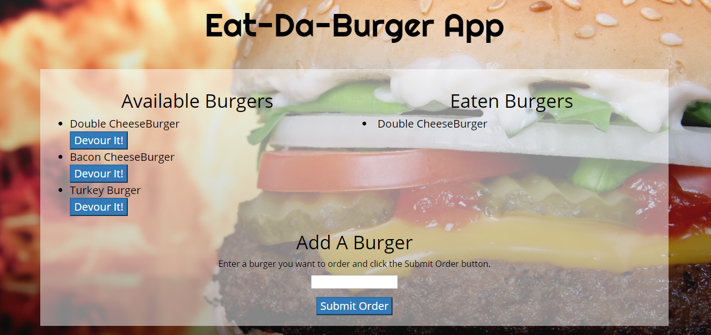

# Sequelized Burger: The Sequel

A burger logger using the MVC design pattern, along with Sequelize,Node, Express, and Handlebars.

## Description
Full stack application with HTML/CSS and elements from Bootstrap framework for front end development and the backend implemented with Node.js and Express. HTML templating is done with the usage of Handlebars.

The user may enter any burger name to add into the menu, and this entry gets entered into the database using Sequelize queries. The initial burger entry is added as available on the menu and placed on the left side of the screen. The user may then "devour" any burger by clicking on the button "devour it", which moves it into the adjacent column and updates its status in the database.

## Setup
To run this application locally, first run this command in your git bash or terminal

    git clone https://github.com/danielladt/Burger2_theSequel.git

Next, be sure to install the dependencies 

    npm install

Also, be sure to add in your own password for mysql workbench in the config.json file

Lastly, run the node server locally

    node server.js

Now, open the local application on port 8080 at the URL: http://localhost:8080/

